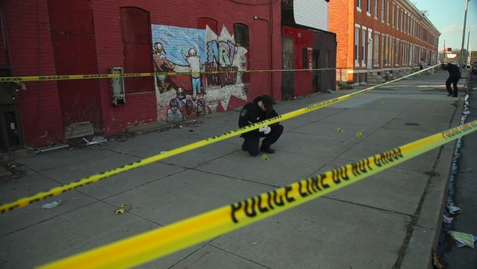
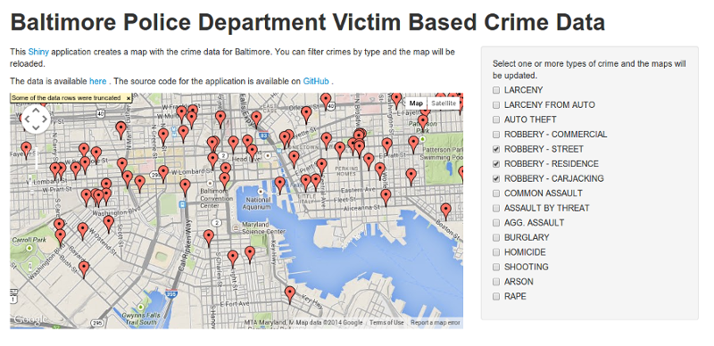

## Baltimore Crime Data



---

## Data

- Available at [Open Baltimore](https://data.baltimorecity.gov/), [here](https://data.baltimorecity.gov/Public-Safety/BPD-Part-1-Victim-Based-Crime-Data/wsfq-mvij).


```r
library(RCurl)
```

```
## Loading required package: bitops
```

```r
data_url <- "https://data.baltimorecity.gov/api/views/wsfq-mvij/rows.csv?accessType=DOWNLOAD"
crime <- read.csv(text=getURL(data_url), na.strings="")
```

- 271981 incidents

- All data geocoded to the approximate latitude/longitude location of the incident.

```r
head(crime$Location.1)
```

```
## [1] (39.3095600000, -76.6419400000) (39.3147400000, -76.5652900000)
## [3] (39.3262200000, -76.5510000000) (39.3227600000, -76.6070800000)
## [5] (39.3529700000, -76.6097700000) (39.3278200000, -76.6093900000)
## 94541 Levels: (37.5772600000, -81.5291900000) ...
```

---

## Data (cont.)

- 15 types of crime.


```r
unique(crime$description)
```

```
##  [1] LARCENY              COMMON ASSAULT       ROBBERY - COMMERCIAL
##  [4] AUTO THEFT           ROBBERY - STREET     AGG. ASSAULT        
##  [7] LARCENY FROM AUTO    BURGLARY             ASSAULT BY THREAT   
## [10] HOMICIDE             ROBBERY - RESIDENCE  SHOOTING            
## [13] ARSON                RAPE                 ROBBERY - CARJACKING
## 15 Levels: AGG. ASSAULT ARSON ASSAULT BY THREAT AUTO THEFT ... SHOOTING
```

---

## Shiny App

- Available at http://sefakilics.rhinyapps.io/coursera-devdataprod
- View crime locations on Baltimore map
- Filter by crime type


